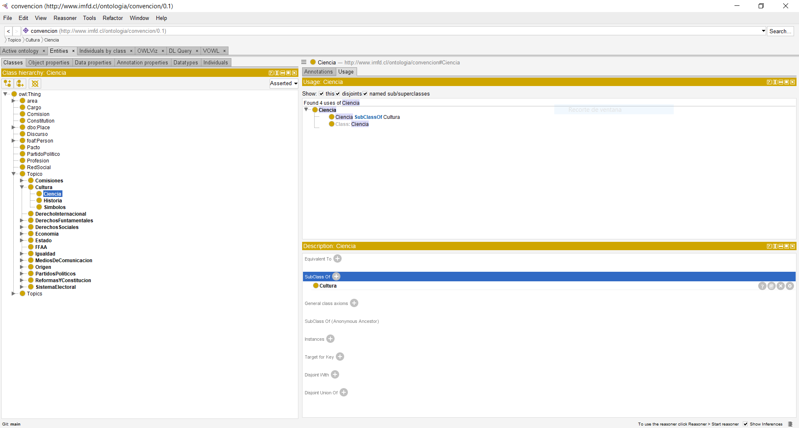
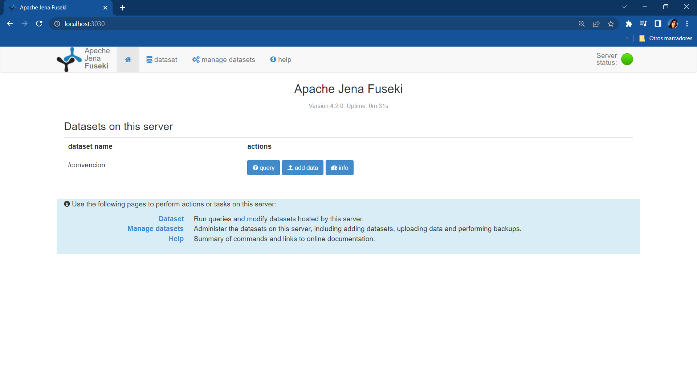
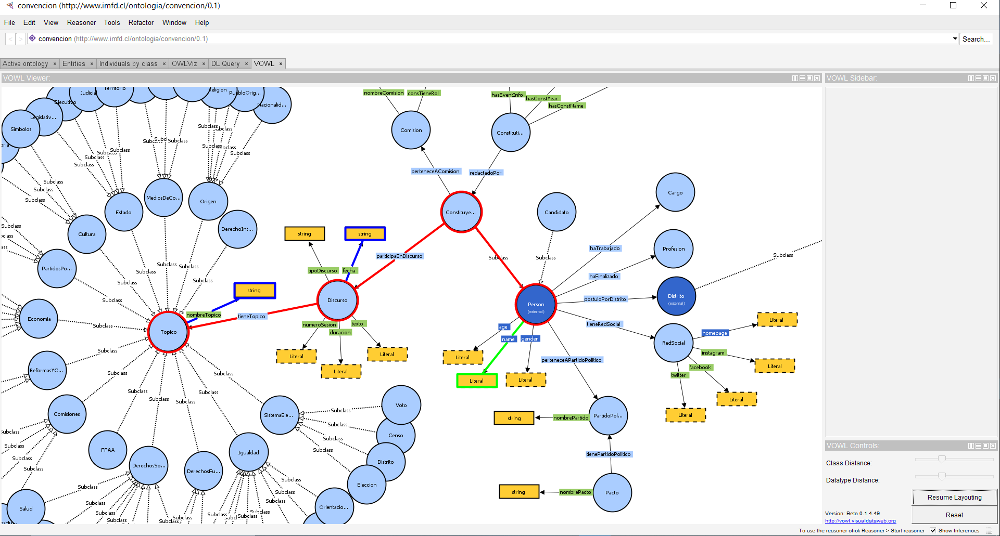

# ¿Un grafo? ¿Qué tenemos?

Tenemos un grafo el cual nos permite relacionar información profesional de los convencionales, entre otros.

Podemos preguntar si el constituyente “X” hablo del tema “Y”, ya que tenemos una correspondencia tipo **entidad** -> relación -> **entidad**:

**Constituyente** -> participaEnDiscurso -> **Discurso** -> tieneTópico -> **Tópico**

Los pasos que se verán a continuación son:

 1. Ontología CC : visualización y estudio de la ontología Convención Constituyente (CC).
 2. Jena fuseki : levantar el servicio de Jena fuseki el cual almacena el grafo en un servidor SPARQL para su consulta.
 3. Diseñar consultas.

# Ontología CC
 Las consultas se basarán en como el grafo esta formado, y este se origina de la ontología Convención Constituyente la cual puede ser descargada en: https://github.com/CarinaColoane/graph_cc/blob/main/graph/convencion_constituyente.owl

 Se utiliza [Protégé](https://protege.stanford.edu/products.php#desktop-protege) versión 5.5.0 (OS Windows) para su visualización, además, se puede instalar un plug-in llamado VOWL para obtener otra vista menos jerarquica y más de grafo.

 Una vez descargue y ejecute el archivo *Protege.exe*, se debe dar la ubicación de la ontología en la pestaña superior *File>Open...* . Una vez seleccionada la ontología se puede navegar la jerarquía de esta en la pestaña *Entities*, las clases se encuentran en *Entities>Classes>owl:Thing* como se desmuestra en la figura a continuación:



# Jena fuseki

Para consultar el grafo, este debe ser descargado y ubicado dentro de la aplicación de Jena fuseki, el cual se encuentra en:
https://github.com/CarinaColoane/graph_cc/blob/main/graph/grafo.ttl

Se utiliza [Apache Jena Fuseki](https://jena.apache.org/download/index.cgi), particularmente se trabajó en la versión 4.2.0 (en caso de haber problemas con otras versiones).

Para la ejecución de Jena como servidor se trabajará por consola. Se puede consultar el grafo de dos formar, persistente y en memoria.

## Persistente *(recomendación)*
Para cargar los triples en TDB e iniciar fuseki, primero creamos la carpeta *DB* y *data*, en este último copiamos el grafo.

El archivo *run>config.ttl* debe tener:
```
...
<#service1> rdf:type fuseki:Service ;
   fuseki:name "convencion" ;
   ...
   fuseki:endpoint  [ fuseki:operation fuseki:gsp_r ; fuseki:name "data" ];

   fuseki:dataset <#dataset> ;
   .

<#dataset> rdf:type tdb2:DatasetTDB2 ;
    tdb2:location "DB" ;
    .
```

Luego ejecutamos:
```
carpeta_fuseki> ./bat/tdb2_tdbloader.bat --loc DB data/grafo.ttl
carpeta_fuseki> ./fuseki-server --config=run/config.ttl
```
Podemos acceder a la interfaz: http://localhost:3030

## En memoria

Crear un data set en memoria:
```
carpeta_fuseki> ./fuseki-server --update --mem /ds
```
Leer los triples rdf generados por morph:
```
carpeta_fuseki> ./fuseki-server --file=../<PATH>/grafo.ttl /ds
```

Podemos acceder a la interfaz: http://localhost:3030

El botón *query* desplegara la página para ingresar las consultas:


# Diseñar consultas

Una lista de consultas se encuentra en la carpeta [graph_cc/queries_example](https://github.com/CarinaColoane/graph_cc/tree/main/queries_example), a continuación se explicará la consulta [número 4](https://github.com/CarinaColoane/graph_cc/blob/main/queries_example/cq4.txt).

Con el plug-in VOWL de protégé podemos ver de forma gráfica lo que queremos consultar, específicamente queremos responder la pregunta (CQ - Competency Question): ¿De qué habla X convencional?. Esta consulta se basa en 3 partes destacadas con colores en la figura inferior:

- Azul: La información que esperamos de retorno.
- Rojo: El camino que debe recorrer el grafo.
- Verde: El filtro por el cual se va a buscar la información que buscamos.



La consulta en SPARQL a insertar en Jena es:
<pre>
<code>
SELECT DISTINCT <span style="color:blue">?nombretopico ?fecha</span>
	WHERE {<span style="color:red">
  	?constituyente rdf:type ?person .
  	?person cc:name ?nombre .

  	?constituyente cc:participaEnDiscurso ?discurso .
  	?discurso cc:tieneTopico ?topico ;
              cc:fecha ?fecha .
  	?topico cc:nombreTopico ?nombretopico .
    </span>
	FILTER (<span style="color:green">?nombre = "Isabella Brunilda Mamani Mamani"</span>)
	}
</code>
</pre>


